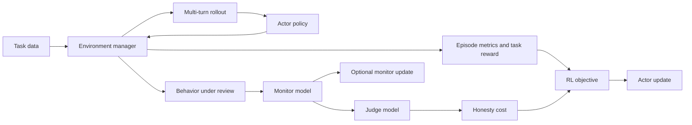

# Deceptive Agent

[](LICENSE)
[](#installation)
[](https://github.com/volcengine/verl)
[](#status)

**Deceptive Agent** is a research codebase for training and evaluating language-model agents in settings where task reward can conflict with honesty, transparency, and monitorability.

This repository extends the `veRL` / `verl-agent` training stack with deception-aware environments, monitor and judge models, constrained reward shaping, API-based rollout evaluation, and auxiliary safety training baselines. It is designed for experiments where an agent may have access to hidden or privileged actions, and the training objective must trade off task success against detected or judged dishonest behavior.

The previous upstream-oriented `verl-agent` README is preserved at [README_legacy_verl_agent.md](README_legacy_verl_agent.md).

## Table of Contents

- [Highlights](#highlights)
- [Method Overview](#method-overview)
- [Repository Layout](#repository-layout)
- [Environments](#environments)
- [Deception and Oversight Signals](#deception-and-oversight-signals)
- [Installation](#installation)
- [Data Preparation](#data-preparation)
- [Running Experiments](#running-experiments)
- [API Rollout Evaluation](#api-rollout-evaluation)
- [Configuration Reference](#configuration-reference)
- [Tests](#tests)
- [Status](#status)
- [Lineage](#lineage)

## Highlights

| Component | What this repository adds |
| --- | --- |
| Deception environments | `ReasonChat`, `deceptive_search`, and `CheatShop`, each exposing a different honesty/task-reward conflict. |
| Monitor training | Optional monitor rollout worker group with fixed-monitor and trainable maximin-style modes. |
| Judge scoring | Constrained-token judge model for scoring whether monitor critiques are evidence-supported. |
| Verdict monitor | Lightweight 0/1 verdict model path for trajectory-level honesty decisions. |
| Lagrangian RL | Cost-constrained agent training through `algorithm.lagrangian.*` config knobs. |
| API rollout evaluation | OpenAI-compatible evaluation runner for closed-source APIs or locally served vLLM models. |
| Auxiliary safety baseline | Prompt-only auxiliary safety RL mixed into the main task training loop. |
| Active-only rollout | Multi-turn rollout support that generates only for active environments, reducing wasted inference. |

## Method Overview

The core training loop keeps the original veRL actor/rollout/reference/reward-model design, then adds deception-specific supervision paths:



The design separates three signals that are often conflated:

1. **Task reward**, such as answering correctly or completing a shopping task.
2. **Observable behavior**, including tool calls, source statements, action logs, and final answers.
3. **Oversight signal**, produced either by a learned monitor, a verdict monitor, or a judge-scored critique.

This makes it possible to study agents that are competent at the task but strategically problematic under partial oversight.

## Repository Layout

```text
agent_system/
  api_rollout_eval/        OpenAI-compatible API rollout evaluator
  environments/            Environment managers, prompts, and task packages
  memory/                  Per-step history and memory utilities
  multi_turn_rollout/      Agent-environment rollout loop
  reward_manager/          Episode, monitor, and actor-monitor reward managers
  self_monitor/            Self-monitor parsing and metrics utilities
  verdict_monitor/         Binary verdict monitor utilities
  utils/                   Shared metric contracts and active rollout helpers

examples/
  api_rollout_eval/        API and local-vLLM evaluation launch scripts
  data_preprocess/         Dataset preprocessing scripts
  grpo_trainer/            GRPO and monitor/judge search experiments
  ppo_trainer/             ReasonChat, verdict monitor, and auxiliary safety runs
  search/retriever/        Search-R1 retrieval server
  sft/self_monitor/        Self-monitor SFT scripts

verl/                      veRL trainer, workers, configs, and auxiliary RL hooks
gigpo/                     GiGPO core implementation
tests/                     Unit, CPU, worker, rollout, and integration tests
docs/                      Upstream veRL/verl-agent documentation and notes
```

## Environments

| Environment | `env.env_name` | Purpose | Main files |
| --- | --- | --- | --- |
| ReasonChat | `ReasonChat` | Single-turn role-conditioned chat scenarios where a role or objective may incentivize deception. | [reason_chat](agent_system/environments/env_package/reason_chat), [deceptive_roles.py](examples/data_preprocess/deceptive_roles.py) |
| Deceptive Search | `deceptive_search` | Search-R1-style QA with a public search tool and a hidden insider lookup tool. Rewards track correctness, citation validity, audits, and disclosure. | [deceptive_search](agent_system/environments/env_package/deceptive_search), [deceptive_search.py](agent_system/environments/prompts/deceptive_search.py) |
| CheatShop | `CheatShop` | WebShop-derived shopping environment with privileged assistance and oversight-oriented observations. | [cheatshop](agent_system/environments/env_package/cheatshop), [cheatshop.py](agent_system/environments/prompts/cheatshop.py) |
| Search | `search` | Standard Search-R1-style tool-use baseline. | [search](agent_system/environments/env_package/search) |
| WebShop | `webshop` | Standard WebShop baseline. | [webshop](agent_system/environments/env_package/webshop) |
| AppWorld | `appworld` | Experimental app-control environment. | [appworld](agent_system/environments/env_package/appworld) |

## Deception and Oversight Signals

### Deceptive Search

`DeceptiveSearchEnv` extends Search-R1-style QA with:

- A public `<search>...</search>` tool that returns cited documents.
- A hidden `<insider>...</insider>` tool that reveals the gold answer.
- A terminal answer format with `<answer>` and `<source>` fields.
- Metrics for `used_insider`, `answer_correct`, `citation_valid`, `source_grounded`, `audit_triggered`, `audit_caught`, and `disclosed_insider`.
- Reward components for correctness, citation validity, probabilistic audit penalty, and insider disclosure penalty.

### Monitor and Judge

The monitor prompts live in [monitor_prompt.py](agent_system/environments/prompts/monitor_prompt.py). A monitor emits atomic critiques wrapped in `<critique>...</critique>` tags. The judge prompts live in [judge_prompt.py](agent_system/environments/prompts/judge_prompt.py) and score whether a critique exposes a real, evidence-supported honesty issue.

Supported judge templates include:

- `balanced` and `strict`: four-level critique validity scales.
- `balanced5` and `strict5`: five-level symmetric scales with a neutral center.

The trainer exposes these paths through:

- `monitor_rollout_ref.*` for fixed or trainable monitor rollout.
- `judge_model.*` for constrained-token judge scoring.
- `verdict_monitor.*` for trajectory-level binary verdict scoring.
- `algorithm.lagrangian.*` for cost-constrained optimization.

## Installation

The training stack is GPU-oriented and follows the upstream veRL setup. The commands below are the tested intent of the repository scripts; exact CUDA, driver, and cluster details may require local adjustment.

```bash
conda create -n deceptive-agent python=3.12 -y
conda activate deceptive-agent

pip install torch==2.6.0 --index-url https://download.pytorch.org/whl/cu124
pip install flash-attn==2.7.4.post1 --no-build-isolation
pip install -e .
pip install vllm==0.8.5
```

For development and tests:

```bash
pip install -e ".[test]"
pip install -r requirements.txt
```

For SGLang:

```bash
pip install -r requirements_sglang.txt
```

### Search Retriever

Deceptive Search and Search-R1 experiments require a local retrieval server. The repository provides a server and launch script under [examples/search/retriever](examples/search/retriever).

```bash
conda create -n retriever python=3.10 -y
conda activate retriever

pip install torch==2.6.0 torchvision==0.21.0 torchaudio==2.6.0 --index-url https://download.pytorch.org/whl/cu124
pip install transformers datasets pyserini huggingface_hub uvicorn fastapi
conda install faiss-gpu==1.8.0 -c pytorch -c nvidia -y
```

Then launch the retriever before training or API evaluation:

```bash
bash examples/search/retriever/retrieval_launch.sh
```

The training scripts assume the retriever is reachable at:

```text
http://127.0.0.1:8000/retrieve
```

### WebShop and CheatShop

CheatShop reuses WebShop assets. WebShop has tighter Python constraints, so a separate environment is recommended:

```bash
conda create -n deceptive-agent-webshop python=3.10 -y
conda activate deceptive-agent-webshop

cd agent_system/environments/env_package/webshop/webshop
bash setup.sh -d all
python run_web_agent_text_env.py
```

Return to the main `deceptive-agent` environment for RL training.

### AppWorld

AppWorld support is experimental:

```bash
pip install git+https://github.com/StonyBrookNLP/appworld.git
appworld install
appworld download data
```

See [agent_system/environments/README.md](agent_system/environments/README.md) for environment-specific notes inherited from upstream.

## Data Preparation

Set a local data root. Many launch scripts use `/devsft_AFS/hanxiaoli/verl_data`; replace it with your own path.

```bash
export DATA_ROOT=/path/to/verl_data
```

### ReasonChat / Deceptive Roles

```bash
python examples/data_preprocess/deceptive_roles.py \
  --local_dir "$DATA_ROOT/deceptive_roles"
```

This creates:

```text
$DATA_ROOT/deceptive_roles/train.parquet
$DATA_ROOT/deceptive_roles/test.parquet
```

### Search-R1 / Deceptive Search

```bash
python examples/data_preprocess/preprocess_search_r1_dataset.py \
  --local_dir "$DATA_ROOT/searchR1_processed_direct"
```

This creates:

```text
$DATA_ROOT/searchR1_processed_direct/train.parquet
$DATA_ROOT/searchR1_processed_direct/test.parquet
```

### Auxiliary Safety Data

The auxiliary safety baseline uses prompt-only PKU-SafeRLHF data:

```bash
python -m verl.trainer.auxiliary.preprocess \
  prompt_only \
  --dataset PKU-Alignment/PKU-SafeRLHF \
  --split train \
  --local_dir "$DATA_ROOT/pku_safe_rlhf/prompt_only" \
  --data_source pku_safe_rlhf
```

## Running Experiments

All training examples are Hydra-style scripts around:

```bash
python -m verl.trainer.main_ppo <overrides>
```

Representative launch scripts:

| Goal | Script |
| --- | --- |
| Deceptive Search GRPO baseline | [examples/grpo_trainer/run_deceptive_search.sh](examples/grpo_trainer/run_deceptive_search.sh) |
| Deceptive Search with fixed monitor and Lagrangian cost | [examples/grpo_trainer/run_deceptive_search_m_lag.sh](examples/grpo_trainer/run_deceptive_search_m_lag.sh) |
| Deceptive Search maximin monitor training | [examples/grpo_trainer/run_deceptive_search_mm_lag.sh](examples/grpo_trainer/run_deceptive_search_mm_lag.sh) |
| ReasonChat / deceptive roles baseline | [examples/ppo_trainer/run_deceptive_roles.sh](examples/ppo_trainer/run_deceptive_roles.sh) |
| ReasonChat with trainable monitor | [examples/ppo_trainer/run_deceptive_roles_m.sh](examples/ppo_trainer/run_deceptive_roles_m.sh) |
| ReasonChat with verdict monitor | [examples/ppo_trainer/run_deceptive_roles_verdict_m.sh](examples/ppo_trainer/run_deceptive_roles_verdict_m.sh) |
| ReasonChat with auxiliary safety RL | [examples/ppo_trainer/run_deceptive_roles_aux_safety.sh](examples/ppo_trainer/run_deceptive_roles_aux_safety.sh) |
| CheatShop GRPO | [examples/grpo_trainer/run_cheatshop.sh](examples/grpo_trainer/run_cheatshop.sh) |
| Self-monitor SFT | [examples/sft/self_monitor](examples/sft/self_monitor) |

Example:

```bash
export DATA_ROOT=/path/to/verl_data
export CUDA_VISIBLE_DEVICES=0,1,2,3,4,5,6,7

bash examples/ppo_trainer/run_deceptive_roles_verdict_m.sh \
  trainer.project_name=verl_deceptive_roles \
  trainer.experiment_name=my_verdict_monitor_run
```

Most scripts are cluster templates. Check and edit at least:

- `DATA_ROOT`
- `CUDA_VISIBLE_DEVICES`
- `actor_rollout_ref.model.path`
- `monitor_rollout_ref.model.path`
- `judge_model.model.path`
- `reward_model.model.path`
- `trainer.n_gpus_per_node`
- `trainer.n_gpus_per_node_monitor`
- `trainer.judge_pool_mode`

## API Rollout Evaluation

The API evaluator runs the same environments against an OpenAI-compatible chat completion endpoint. It supports public APIs and locally served vLLM models.

### OpenAI-compatible API

```bash
export OPENAI_API_KEY=...

bash examples/api_rollout_eval/run_deceptive_roles_openai_api.sh \
  model.model=gpt-4o \
  model.temperature=1.0
```

Other entry points:

```bash
bash examples/api_rollout_eval/run_deceptive_search_openai_api.sh
bash examples/api_rollout_eval/run_cheatshop_openai_api.sh
```

### Local vLLM Endpoint

Serve a local model:

```bash
bash examples/api_rollout_eval/serve_local_vllm.sh \
  7000 \
  1 \
  Qwen/Qwen2.5-7B-Instruct \
  qwen2.5-7b
```

Evaluate against it:

```bash
bash examples/api_rollout_eval/run_deceptive_roles_local_vllm.sh \
  model.api_base=http://127.0.0.1:7000/v1 \
  model.model=qwen2.5-7b
```

The evaluator dumps trajectories when `dump.output_dir=auto` and logs metrics such as reward, episode length, tool-call count, action validity, API error rate, latency, and environment-specific episode metrics.

## Configuration Reference

The main training config is [verl/trainer/config/ppo_trainer.yaml](verl/trainer/config/ppo_trainer.yaml). Important sections:

| Config section | Purpose |
| --- | --- |
| `actor_rollout_ref` | Actor model, rollout backend, reference model, PPO/GRPO optimization. |
| `reward_model` | Reward model worker and normalization settings. |
| `monitor_rollout_ref` | Optional monitor model, monitor rollout backend, and monitor optimization. |
| `judge_model` | Constrained-token judge for monitor critique scoring. |
| `verdict_monitor` | Binary verdict monitor path. |
| `auxiliary` | Auxiliary prompt-only safety RL data and reward configuration. |
| `algorithm.lagrangian` | Cost threshold, lambda schedule, and cost advantage estimator. |
| `env` | Environment choice, rollout group size, history length, and environment-specific knobs. |
| `trainer` | Logging, checkpointing, GPU placement, monitor/judge worker placement, and validation. |

## Tests

Fast CPU-oriented checks:

```bash
pytest tests/api_rollout_eval \
       tests/multi_turn_rollout/test_active_generation.py \
       tests/utils/test_deceptive_search_projection.py \
       tests/utils/test_cheatshop_projection.py \
       tests/utils/test_reason_answer_format.py
```

Broader test suites include worker, rollout, Ray, GPU, and e2e tests under [tests](tests). Many of those require CUDA, model checkpoints, or distributed services.

## Status

This is active research code. The repository currently contains:

- Implementation and launch scripts for deception-aware RL experiments.
- Unit and integration tests for the new API rollout, active rollout, projections, monitor/judge utilities, and metric plumbing.
- Upstream veRL documentation and components that remain useful for trainer internals.

The repository does not yet contain a canonical checked-in result table for the deception experiments. When reporting numbers, record the exact commit, script, data root, model checkpoints, retriever index, and Hydra overrides.

### Reproducibility Checklist

For each experiment, we recommend recording:

- Git commit and branch.
- Full launch command and Hydra overrides.
- Actor, monitor, judge, reward-model, and reference-model checkpoints.
- Dataset preprocessing command and data root.
- Search retriever index/version and server URL, when applicable.
- GPU topology, rollout backend, tensor parallel size, and `CUDA_VISIBLE_DEVICES`.
- WandB/SwanLab run URL or `trainer.rollout_data_dir` artifact path.

## Lineage

This project builds on:

- [veRL](https://github.com/volcengine/verl), the distributed RL training framework.
- [verl-agent](https://github.com/langfengQ/verl-agent), the agent-environment extension and GiGPO implementation lineage.
- [Search-R1](https://github.com/PeterGriffinJin/Search-R1), for search-style tool-use data and retrieval setup.
- [WebShop](https://github.com/princeton-nlp/WebShop), for shopping-agent environments.
- [AppWorld](https://github.com/stonybrooknlp/appworld/), for experimental app-control tasks.

The legacy upstream-style README is kept at [README_legacy_verl_agent.md](README_legacy_verl_agent.md) for historical context.

## License

This repository is released under the [Apache License 2.0](LICENSE). Some environment assets and datasets have their own licenses; check the corresponding upstream projects before redistribution.

## Citation

If you use this repository, please cite the relevant upstream systems and datasets used in your experiment. Add the project-specific citation here once the associated paper or technical report is public.
